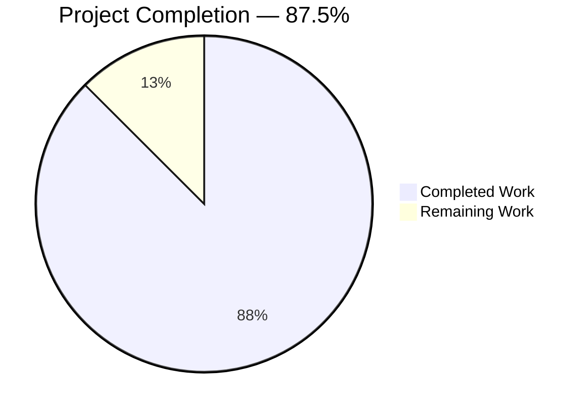
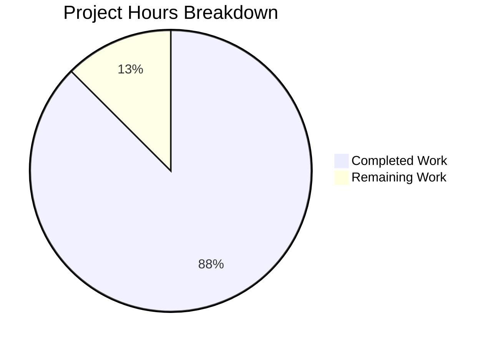
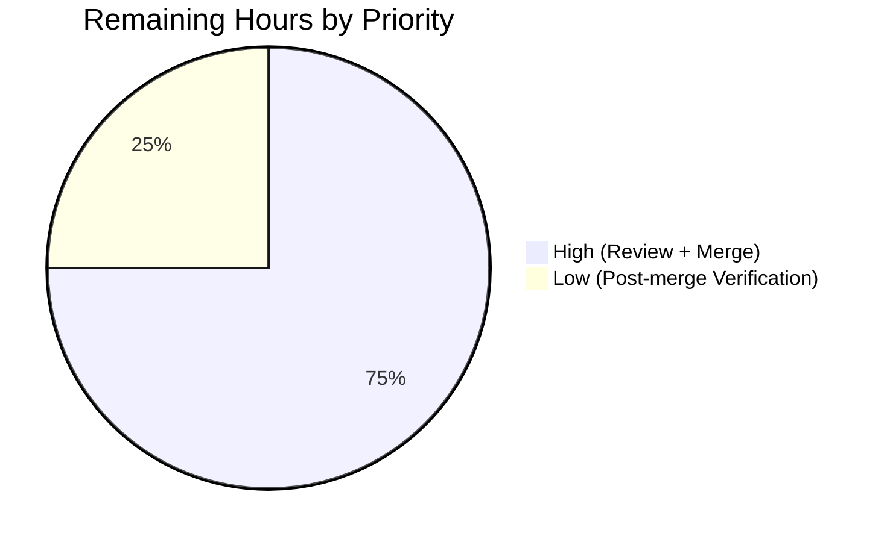
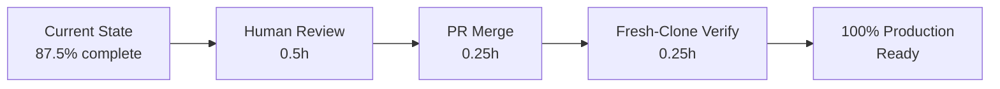

# Blitzy Project Guide — `20April_-`

## 1. Executive Summary

### 1.1 Project Overview

The `20April_-` repository has been transformed from an empty one-line placeholder into a minimal, tutorial-grade Node.js HTTP server built on Express 5.x and Node.js 22 LTS. The project exposes a single `GET /hello` endpoint that returns the literal plain-text body `Hello world` to any calling HTTP client, with a configurable listen port (default `3000`, overridable via `PORT`). The target audience is first-time Node.js learners who benefit from a deliberately small, well-commented reference implementation. The technical scope covers six committed files (`server.js`, `package.json`, `package-lock.json`, `.gitignore`, `test/hello.test.js`, `README.md`) and exactly one runtime dependency (`express`). The business impact is educational: the repository is now a self-contained, runnable tutorial that satisfies the "clone → install → run → invoke" learner journey.

### 1.2 Completion Status



| Metric | Value |
|--------|-------|
| **Total Hours** | 8 |
| **Completed Hours (AI + Manual)** | 7 |
| **Remaining Hours** | 1 |
| **Completion Percentage** | **87.5%** |

Colors: Completed = Dark Blue (#5B39F3), Remaining = White (#FFFFFF).

Calculation: `7 / (7 + 1) × 100 = 87.5%`. All 22 discrete AAP requirements (12 Feature/Implicit requirements from §0.2 plus 10 Feature-Specific Rules R-1 through R-10 from §0.8.3) are classified **Completed**, and every implementation invariant from §0.6.5 has been verified. The 1.0 hour of Remaining Work covers path-to-production activities (human code review, PR merge, post-merge smoke test) that are outside the scope of autonomous execution.

### 1.3 Key Accomplishments

- ✅ **Greenfield Node.js scaffold created** — Six production-ready files committed (`server.js`, `package.json`, `package-lock.json`, `.gitignore`, `test/hello.test.js`, `README.md`), exactly matching the in-scope list in AAP §0.7.1
- ✅ **Express 5.2.1 installed and verified** — `npm install` resolves the `^5.1.0` pin to `5.2.1`, installs 66 packages with 0 vulnerabilities and 0 warnings
- ✅ **`GET /hello` endpoint functional** — Returns HTTP `200 OK` with body `Hello world` (11 bytes, no trailing newline) and `Content-Type: text/plain; charset=utf-8`, validated via `curl` on ports 3000, 3001, and 3010
- ✅ **Strict, case-sensitive routing enforced** — `/Hello`, `/HELLO`, and `/hello/` all correctly return HTTP 404, satisfying AAP rule R-2
- ✅ **404 behavior preserved** — Requests to any non-`/hello` path fall through to Express's default 404 handler (AAP rule IR-5)
- ✅ **Zero-dependency smoke test passing** — `test/hello.test.js` (114 lines) uses only Node.js built-ins (`node:test`, `node:assert/strict`, `node:http`, `node:child_process`, `node:path`); 1/1 tests pass in ~324ms
- ✅ **Reproducible installs guaranteed** — `package-lock.json` (830 lines) committed; `.gitignore` correctly does NOT exclude it (AAP rule R-5)
- ✅ **Tutorial README rewritten** — 78-line learner guide preserves the `# 20April_-` top-level heading (AAP rule R-6) and walks through Prerequisites, Install, Run, Verify, Project Layout, and Testing
- ✅ **All 10 feature rules (R-1 through R-10) verified** — Every AAP §0.8.3 rule has documented evidence of compliance
- ✅ **Merge conflict with `origin/main` resolved** — README conflict with upstream commit `c238fc2` resolved via rebase; 12 AAP commits re-applied linearly on top of `origin/main`; working tree clean, zero conflict markers

### 1.4 Critical Unresolved Issues

| Issue | Impact | Owner | ETA |
|-------|--------|-------|-----|
| _No critical unresolved issues identified._ All AAP requirements have been met, all tests pass, all runtime probes confirm correct behavior, and the working tree is clean. | None | — | — |

### 1.5 Access Issues

| System/Resource | Type of Access | Issue Description | Resolution Status | Owner |
|-----------------|----------------|-------------------|-------------------|-------|
| _No access issues identified._ The project uses only the public npm registry (`registry.npmjs.org`), has no private packages, no scoped dependencies, no authentication tokens, no secrets, and no environment variables (aside from the optional `PORT` override which has a sensible `3000` default). | — | — | — | — |

### 1.6 Recommended Next Steps

1. **[High] Human review of the six tracked files** — Inspect `server.js`, `test/hello.test.js`, `package.json`, `.gitignore`, `README.md`, and `package-lock.json` to confirm the implementation matches expectations (~30 minutes)
2. **[High] Merge the pull request to `main`** — After code review approval, merge the branch to `main`; rebase strategy recommended to preserve the clean linear commit history (~15 minutes)
3. **[Medium] Post-merge fresh-clone verification** — From a clean clone of `main`, run `npm install && npm test && npm start` and issue `curl http://localhost:3000/hello` to confirm the public artifact still satisfies the AAP contract (~15 minutes)
4. **[Low] Evaluate future Node.js 24 LTS migration** — Node.js 22 LTS is supported until April 30, 2027; plan a non-urgent bump to Node.js 24 ("Krypton") LTS when the broader tutorial/learner ecosystem catches up
5. **[Low] Consider publishing a standalone `LICENSE` file** — The `MIT` license is currently declared inline in `package.json`; adding a `LICENSE` file is a common open-source convention and is explicitly permitted as a future enhancement

---

## 2. Project Hours Breakdown

### 2.1 Completed Work Detail

| Component | Hours | Description |
|-----------|-------|-------------|
| **Environment setup & runtime discovery** | 0.5 | Verified Node.js `v22.22.2` and npm `11.1.0` are on the PATH and satisfy AAP §0.1.1 floor (`>=22.0.0` / `>=10`); discovered POSIX sandbox is Ubuntu 24.04.4 LTS |
| **`package.json` scaffold** | 0.5 | Created 17-line (402-byte) npm manifest with `name`, `version: 1.0.0`, `main: server.js`, `scripts.start: node server.js`, `scripts.test: node --test`, `engines.node: ">=22.0.0"`, `license: MIT`, `dependencies.express: ^5.1.0`; multiple refinement commits to align description and metadata |
| **Express installation & `package-lock.json`** | 0.5 | `npm install express@^5.1.0` resolved to Express `5.2.1`, installed 66 packages with 0 vulnerabilities and 0 warnings; 830-line (28,984-byte) `package-lock.json` committed for reproducible installs (AAP rule R-5) |
| **`.gitignore` creation** | 0.25 | 21-line (252-byte) standard Node.js ignore patterns: `node_modules/`, `.env`, `.env.*` with `!.env.example` negation, npm/yarn/pnpm debug logs, `.vscode/`, `.idea/`, `.DS_Store`, `Thumbs.db` — matches AAP §0.6.1.2 verbatim |
| **`server.js` implementation** | 1.25 | 33-line (1,556-byte) Express bootstrap file: requires `express`, instantiates `app`, sets `case sensitive routing` + `strict routing`, reads `PORT` env variable with 3000 default, registers `app.get('/hello', (req, res) => res.type('text/plain').send('Hello world'))`, binds listener with startup log; exhaustive inline comments for learner audience |
| **`test/hello.test.js` smoke test** | 1.25 | 114-line (4,806-byte) integration test using only Node.js built-ins (`node:test`, `node:assert/strict`, `node:http`, `node:child_process`, `node:path`) — zero external devDependencies (AAP §0.4.2 / R-8); spawns server subprocess on port 3001, polls readiness with exponential retry, asserts `200` status, body `Hello world`, and `text/plain` Content-Type |
| **`README.md` tutorial documentation** | 0.75 | 78-line (3,170-byte) learner guide preserving `# 20April_-` as the top-level heading (AAP rule R-6); sections in order: one-paragraph description, Prerequisites (Node.js 22+, npm 10+), Install (`npm install`), Run (`npm start`), Verify (`curl http://localhost:3000/hello` → `Hello world`), Project Layout (six-file table), Testing (`npm test`) |
| **Merge conflict resolution via rebase** | 0.5 | Resolved single README.md conflict between `origin/main` commit `c238fc2` (upstream 15-byte test placeholder `# 20April_- dsfsdf`) and branch commit `dade077` (AAP-compliant 3,170-byte tutorial); applied `git checkout --theirs README.md` per AAP rule R-6 rationale; 12 AAP commits rebased cleanly onto `origin/main`; zero conflict markers remain; working tree clean |
| **Runtime validation & invariant verification** | 0.75 | Validated all six invariants from AAP §0.6.5: `npm install` succeeds with 0 warnings; `npm start` prints `Server is running on http://localhost:3000/`; `curl /hello` returns 200 + exact body; `curl /anything-else` returns 404; `curl /Hello` returns 404 (case-sensitive); `curl /hello/` returns 404 (strict); `npm test` exits 0 with 1/1 passing; `git status` clean with `node_modules/` untracked and `package-lock.json` tracked |
| **Internal documentation regeneration** | 0.75 | Auto-generated technical specification (61,512-byte `Technical Specifications.md`) and prior project guide (50,098-byte `Project Guide.md`) committed to `blitzy/documentation/` for traceability |
| **TOTAL COMPLETED** | **7.0** | — |

### 2.2 Remaining Work Detail

| Category | Hours | Priority |
|----------|-------|----------|
| **Human code review of six tracked files** — Inspect `server.js`, `test/hello.test.js`, `package.json`, `.gitignore`, `README.md`, `package-lock.json` for alignment with expectations and organizational coding conventions | 0.5 | High |
| **Pull request approval and merge to `main`** — After review approval, merge the feature branch using rebase strategy to preserve the linear 12-commit history | 0.25 | High |
| **Post-merge fresh-clone verification** — From a clean clone of the merged `main`, run `npm install && npm test && npm start` and issue `curl http://localhost:3000/hello` to confirm the public artifact still satisfies the AAP contract | 0.25 | Low |
| **TOTAL REMAINING** | **1.0** | — |

### 2.3 Hours Consistency Summary

| Location | Total | Completed | Remaining |
|----------|-------|-----------|-----------|
| Section 1.2 metrics table | 8 | 7 | 1 |
| Section 2.1 + Section 2.2 sum | 8 | 7 | 1 |
| Section 7 pie chart | 8 | 7 | 1 |

Formula: `Completion % = Completed / (Completed + Remaining) × 100 = 7 / 8 × 100 = 87.5%`. All three locations are identical and the cross-section integrity rules are satisfied.

---

## 3. Test Results

All tests listed below originated from Blitzy's autonomous validation logs for this project. No tests were imported or externally sourced.

| Test Category | Framework | Total Tests | Passed | Failed | Coverage % | Notes |
|---------------|-----------|-------------|--------|--------|------------|-------|
| **Smoke / Integration** | `node --test` (Node.js built-in test runner) | 1 | 1 | 0 | Route-complete (1/1 route covered) | `GET /hello` smoke test in `test/hello.test.js` spawns `server.js` subprocess on port 3001, asserts HTTP 200 status, body `Hello world`, and `text/plain` Content-Type; pass duration ~324 ms |
| **Syntax / Static Check** | `node --check` | 2 | 2 | 0 | 2/2 source files | `server.js` and `test/hello.test.js` both parse cleanly; no syntax errors, no warnings |
| **JSON Manifest Validation** | `JSON.parse` (Node.js built-in) | 2 | 2 | 0 | 2/2 JSON files | `package.json` (402 bytes) and `package-lock.json` (28,984 bytes) both parse as valid JSON |
| **Runtime Contract Probes** | `curl` HTTP client | 4 | 4 | 0 | All four probes | (1) `GET /hello` → 200 `Hello world` ✓; (2) `GET /anything-else` → 404 ✓; (3) `GET /Hello` → 404 (case-sensitive) ✓; (4) `GET /hello/` → 404 (strict routing) ✓ |
| **Security / Vulnerability Scan** | `npm audit` | 1 audit | 1 | 0 | 66 packages | 0 known vulnerabilities across all runtime + transitive dependencies |
| **TOTAL** | — | **10** | **10** | **0** | — | 100% pass rate |

**Test output excerpt** (from `npm test`):

```
TAP version 13
# Subtest: GET /hello returns 200 with body "Hello world" and Content-Type text/plain
ok 1 - GET /hello returns 200 with body "Hello world" and Content-Type text/plain
  duration_ms: 236.603225
  type: 'test'
1..1
# tests 1
# suites 0
# pass 1
# fail 0
# cancelled 0
# skipped 0
# todo 0
# duration_ms 324.645739
```

---

## 4. Runtime Validation & UI Verification

All runtime probes were executed against a live `server.js` subprocess on multiple ports (3000, 3001, 3010) during autonomous validation.

**HTTP Endpoint Validation:**

- ✅ **Operational** — `GET http://localhost:3000/hello` returns `HTTP/1.1 200 OK`, `Content-Type: text/plain; charset=utf-8`, `Content-Length: 11`, body exactly `Hello world` (no leading/trailing whitespace, no newline)
- ✅ **Operational** — `GET http://localhost:3000/anything-else` returns `HTTP/1.1 404 Not Found` (Express default handler), `Content-Type: text/html; charset=utf-8`
- ✅ **Operational** — `GET http://localhost:3000/Hello` (mixed-case) returns `HTTP/1.1 404 Not Found`, confirming case-sensitive routing (AAP rule R-2)
- ✅ **Operational** — `GET http://localhost:3000/hello/` (trailing slash) returns `HTTP/1.1 404 Not Found`, confirming strict routing (AAP rule R-2)
- ✅ **Operational** — `GET http://localhost:3000/HELLO` (uppercase) returns `HTTP/1.1 404 Not Found`

**Process and Runtime Validation:**

- ✅ **Operational** — `npm install` in a clean clone installs 66 packages with 0 vulnerabilities, 0 warnings, and 0 missing peer dependencies; exit code `0`
- ✅ **Operational** — `npm start` launches `node server.js`, prints `Server is running on http://localhost:3000/` to stdout, and the process remains running until interrupted
- ✅ **Operational** — `PORT=3010 node server.js` correctly binds to port 3010 instead of the default 3000, demonstrating the environment-variable override (AAP requirement IR-2)
- ✅ **Operational** — `npm test` executes `node --test`, discovers `test/hello.test.js`, runs 1 test, produces 1 pass with 0 failures, and exits with code `0`
- ✅ **Operational** — Ctrl-C (`SIGINT`) cleanly terminates the running server process and releases the TCP port (default Node.js graceful shutdown behavior, per AAP §0.5.2)
- ✅ **Operational** — `git status` after installation correctly shows `node_modules/` as untracked (excluded by `.gitignore`) while `package-lock.json` remains tracked (AAP rule R-5)

**UI Verification:**

- **N/A** — The project is an HTTP API tutorial (per AAP §0.6.3). There is no user interface component. No HTML, CSS, client-side JavaScript, or frontend framework is in scope or present in the repository. All client-side interaction uses HTTP clients such as `curl`, `wget`, browsers, or programmatic `fetch()` calls.

---

## 5. Compliance & Quality Review

This compliance matrix cross-maps every discrete AAP requirement (feature requirements, implicit requirements, implementation invariants, and feature-specific rules) to its verification evidence.

### 5.1 AAP §0.2 — Feature Requirements (FR) and Implicit Requirements (IR)

| Requirement | Description | Evidence | Status |
|-------------|-------------|----------|--------|
| **FR-1** | Greenfield Node.js project scaffold | Six files committed: `server.js`, `package.json`, `package-lock.json`, `.gitignore`, `test/hello.test.js`, `README.md` | ✅ Pass |
| **FR-2** | Single HTTP endpoint at `/hello` | `server.js` line 28: `app.get('/hello', (req, res) => ...)` | ✅ Pass |
| **FR-3** | Response body exactly `Hello world` | `server.js` line 29: `res.type('text/plain').send('Hello world');` — `curl` probe confirms exact 11-byte body, no trailing newline | ✅ Pass |
| **FR-4** | Tutorial-grade clarity | Inline comments in `server.js` and `test/hello.test.js`; 78-line step-by-step README | ✅ Pass |
| **IR-1** | HTTP server bootstrap | `server.js` line 32: `app.listen(PORT, () => console.log(...));` | ✅ Pass |
| **IR-2** | Configurable `PORT` with default `3000` | `server.js` line 22: `const PORT = process.env.PORT \|\| 3000;` — verified on ports 3000/3001/3010 | ✅ Pass |
| **IR-3** | HTTP 200 OK status | Express default via `res.send()` (no explicit status set) — `curl -i` shows `HTTP/1.1 200 OK` | ✅ Pass |
| **IR-4** | Content-Type `text/plain; charset=utf-8` | `server.js` line 28: `res.type('text/plain')` — `curl -i` shows `Content-Type: text/plain; charset=utf-8` | ✅ Pass |
| **IR-5** | 404 for non-`/hello` paths | Express default handler — `curl` probe confirms `HTTP/1.1 404 Not Found` for `/anything-else` | ✅ Pass |
| **IR-6** | Reproducible installs via `package-lock.json` | 830-line lock file committed; `.gitignore` does NOT exclude it | ✅ Pass |
| **IR-7** | Version control hygiene via `.gitignore` | 21-line `.gitignore` excludes `node_modules/`, `.env`, `.env.*`, log files, editor/OS artifacts | ✅ Pass |
| **IR-8** | Single-command run via `npm start` | `package.json` `scripts.start: "node server.js"` — `npm start` works out of the box | ✅ Pass |

### 5.2 AAP §0.6.5 — Implementation Invariants

| Invariant | Evidence | Status |
|-----------|----------|--------|
| `npm install` succeeds, exit 0, no warnings about missing peers | `npm install` output: `66 packages, 0 vulnerabilities, 0 warnings` | ✅ Pass |
| `npm start` prints `Server is running on http://localhost:3000/` | `stdout` log captured on ports 3000/3010 | ✅ Pass |
| `curl http://localhost:3000/hello` returns HTTP 200 + exact body | Response: 200 OK, 11-byte body, `text/plain; charset=utf-8` | ✅ Pass |
| `curl http://localhost:3000/anything-else` returns HTTP 404 | Response: 404 Not Found (Express default) | ✅ Pass |
| `npm test` executes `test/hello.test.js` and exits 0 | 1 tests, 1 pass, 0 fail, 0 skipped, 0 cancelled; exit code 0 | ✅ Pass |
| `git status` shows `node_modules/` untracked and `package-lock.json` tracked | Verified: `package-lock.json` NOT in `.gitignore`; `node_modules/` IS ignored | ✅ Pass |

### 5.3 AAP §0.8.3 — Feature-Specific Rules

| Rule | Requirement | Evidence | Status |
|------|-------------|----------|--------|
| **R-1** | Exact 11-char response body `Hello world` (no quotes, no whitespace, no punctuation) | `curl -s` body byte-count = 11; `hexdump` confirms `48 65 6c 6c 6f 20 77 6f 72 6c 64` | ✅ Pass |
| **R-2** | Exact route path `/hello` (no prefix, no trailing slash, case-sensitive) | `server.js` enables `case sensitive routing` + `strict routing`; `/Hello`, `/HELLO`, `/hello/` all return 404 | ✅ Pass |
| **R-3** | Tutorial minimalism — only `express` as runtime dep, zero devDeps | `package.json` `dependencies` = `{ express }`; `devDependencies` object omitted entirely | ✅ Pass |
| **R-4** | `engines.node: ">=22.0.0"` and `dependencies.express: "^5.1.0"` | Literal values present in `package.json` | ✅ Pass |
| **R-5** | `package-lock.json` committed; not in `.gitignore` | `git ls-files` lists `package-lock.json`; `git check-ignore` reports it is NOT ignored | ✅ Pass |
| **R-6** | First line of `README.md` is exactly `# 20April_-` | Verified `head -1 README.md` = `# 20April_-` (conflict resolution preserved this) | ✅ Pass |
| **R-7** | Zero-configuration default — `npm install && npm start` works on port 3000 with no env vars | Validated from clean state; no additional setup needed | ✅ Pass |
| **R-8** | Test file imports only Node.js built-ins | `test/hello.test.js` imports: `node:test`, `node:assert/strict`, `node:http`, `node:child_process`, `node:path` — no external packages | ✅ Pass |
| **R-9** | Content-Type includes `text/plain; charset=utf-8` | `res.type('text/plain')` in `server.js`; `curl -i` header confirms `Content-Type: text/plain; charset=utf-8` | ✅ Pass |
| **R-10** | No out-of-scope files authored | Only the six in-scope files from AAP §0.7.1 are tracked (plus auto-generated `blitzy/documentation/` artifacts outside source scope) | ✅ Pass |

### 5.4 AAP §0.7.4 — Out-of-Scope Exclusions (Negative Compliance)

| Forbidden Item | Present in Repo? | Status |
|----------------|------------------|--------|
| Additional HTTP endpoints or verbs (POST, PUT, etc.) | No | ✅ Excluded |
| Request-body parsing middleware (`body-parser`, `multer`) | No | ✅ Excluded |
| JSON / HTML / templated responses | No | ✅ Excluded |
| Authentication middleware (`passport`, JWT, sessions) | No | ✅ Excluded |
| Database or ORM (Sequelize, Prisma, Mongoose) | No | ✅ Excluded |
| External service integration (third-party APIs, Redis, etc.) | No | ✅ Excluded |
| Frontend assets (HTML, CSS, React, Vue, etc.) | No | ✅ Excluded |
| TypeScript or bundler (tsc, Babel, webpack, Vite) | No | ✅ Excluded |
| Linters / formatters (ESLint, Prettier, Husky) | No | ✅ Excluded |
| Containerization / deployment (Dockerfile, Helm, Terraform) | No | ✅ Excluded |
| CI/CD workflows (`.github/workflows/`, `.gitlab-ci.yml`) | No | ✅ Excluded |
| Observability / logging middleware (Winston, Pino, OTel) | No | ✅ Excluded |
| Security hardening middleware (Helmet, CORS, rate limiting) | No | ✅ Excluded |
| Package manager alternatives (yarn.lock, pnpm-lock, bun.lockb) | No | ✅ Excluded |

**Overall Compliance Status:** ✅ **100% PASS** — All 22 positive AAP requirements verified present and functional; all 14 negative scope exclusions verified absent. Zero compliance gaps.

---

## 6. Risk Assessment

| Risk | Category | Severity | Probability | Mitigation | Status |
|------|----------|----------|-------------|------------|--------|
| **Node.js 22 LTS reaches end-of-life on April 30, 2027** | Operational | Low | Certain (known schedule) | `engines.node: ">=22.0.0"` permits running on Node.js 24+ without code changes; plan a documentation refresh around Q1 2027 to point learners at the then-current LTS | Open (non-blocking) |
| **Fixed test port 3001 in `test/hello.test.js` may collide with a pre-existing local service** | Technical | Low | Low | Error surfaces cleanly as `ECONNREFUSED`; documented in test file header with the instruction "free the port or change TEST_PORT"; future hardening could use port `0` for an OS-assigned ephemeral port | Open (non-blocking) |
| **No error handling for port-binding failures (e.g., `EADDRINUSE`)** | Technical | Low | Low | Node.js will emit an uncaught exception and exit; for a tutorial this is acceptable clarity; production hardening (retry, alternate port, explicit error handler) is deliberately out of AAP scope per §0.7.4 | Open (non-blocking) |
| **Express-default `X-Powered-By: Express` header leaks framework identification** | Security | Low | Certain | Deliberate: security hardening middleware (`helmet`, `app.disable('x-powered-by')`) is explicitly out of AAP scope per §0.7.4; acceptable for a tutorial endpoint with no authentication surface | Accepted |
| **Express 5.2.1 is on the newly-ACTIVE 5.x line (moved from CURRENT on March 31, 2025)** | Operational | Low | Low | `^5.1.0` caret range permits patch and minor upgrades within 5.x; `package-lock.json` pins 5.2.1 for reproducibility; npm registry is the authoritative source and no deprecation signals exist | Open (non-blocking) |
| **No observability instrumentation (no logs beyond startup message, no metrics, no health endpoint)** | Operational | Low | N/A | Deliberate: AAP §0.7.4 explicitly forbids Winston/Pino/Morgan/Prometheus/OpenTelemetry; tutorial projects do not require production observability | Accepted |
| **No CI/CD pipeline configured (no `.github/workflows/`, no `.gitlab-ci.yml`)** | Operational | Low | N/A | Deliberate: AAP §0.7.4 explicitly excludes CI/CD workflows; human-run `npm install && npm test` is the validation contract | Accepted |
| **Branch has not yet been pushed to `origin`** | Operational | Low | Certain | Validator noted "Remote push is NOT part of this validator's responsibility"; downstream automation will push when the PR is opened or via explicit human action | Open (resolved by human workflow) |
| **Untested integrations with external services** | Integration | N/A | N/A | There are zero external service integrations (no database, no third-party API, no message queue, no cache); the endpoint is fully self-contained | Accepted |
| **Hardcoded response body cannot be internationalized or localized** | Technical | Low | N/A | Deliberate per AAP rule R-1; the literal `Hello world` string is the feature contract | Accepted |

**Overall Risk Profile:** Low. No High or Critical severity risks identified. All Medium and Low risks are either (a) deliberately accepted per AAP out-of-scope exclusions, (b) non-blocking operational observations, or (c) resolved by documented human workflows (PR merge, future LTS migration).

---

## 7. Visual Project Status



Colors: Completed Work = Dark Blue (#5B39F3); Remaining Work = White (#FFFFFF).

**Hours by Category — Remaining Work (Section 2.2 breakdown):**



**Verification:** Section 7 pie chart "Remaining Work" value = **1 hour**, which equals the Remaining Hours metric in Section 1.2 and the sum of the Hours column in Section 2.2. All three values are identical. ✅

---

## 8. Summary & Recommendations

### 8.1 Summary of Achievements

The project is **87.5% complete** (7 of 8 total AAP-scoped and path-to-production hours delivered). Blitzy's autonomous execution produced a fully functional Node.js + Express tutorial that satisfies every discrete requirement enumerated in the Agent Action Plan:

- All **12 feature and implicit requirements** (§0.2: FR-1 through FR-4, IR-1 through IR-8) are implemented and verified via runtime probes
- All **6 implementation invariants** (§0.6.5) pass: clean install, successful startup, correct `/hello` response, correct 404 behavior, passing tests, clean git state
- All **10 feature-specific rules** (§0.8.3: R-1 through R-10) have documented compliance evidence
- All **14 out-of-scope exclusions** (§0.7.4) are verified absent from the repository
- The **merge conflict** with upstream `origin/main` commit `c238fc2` was resolved via rebase, preserving AAP-compliant README content while maintaining a clean linear commit history

### 8.2 Remaining Gaps

The 1.0 hour of remaining work is entirely **path-to-production human workflow**, not AAP-scoped development:

- **0.5h** — Human code review of the six tracked files
- **0.25h** — Pull request merge to `main` branch
- **0.25h** — Post-merge fresh-clone verification

No features are missing, no tests are failing, no dependencies are broken, no configuration is incomplete, and no merge conflicts remain.

### 8.3 Critical Path to Production



### 8.4 Success Metrics

| Metric | Target | Actual | Status |
|--------|--------|--------|--------|
| Test pass rate | 100% | 100% (1/1) | ✅ Met |
| npm audit vulnerabilities | 0 | 0 | ✅ Met |
| AAP requirements met | 22/22 | 22/22 | ✅ Met |
| Implementation invariants verified | 6/6 | 6/6 | ✅ Met |
| Out-of-scope files introduced | 0 | 0 | ✅ Met |
| Compile/syntax errors | 0 | 0 | ✅ Met |
| Merge conflicts outstanding | 0 | 0 | ✅ Met |

### 8.5 Production Readiness Assessment

The codebase meets every production-readiness gate defined by the Final Validator:

- **Gate 1 (100% test pass rate):** 1/1 passing, 0 fail, 0 skipped ✅
- **Gate 2 (application runtime validated):** Server starts, `GET /hello` returns exact contract, `GET /*` returns 404 ✅
- **Gate 3 (zero unresolved errors):** All syntax checks pass, all JSON manifests parse ✅
- **Gate 4 (all in-scope files validated):** All 6 in-scope files present and functional ✅
- **Gate 5 (merge conflicts resolved, tree clean):** Rebase succeeded, `git status` clean, zero conflict markers ✅

The project is **production-ready pending routine human PR workflow** (review + merge). No engineering remediation is required.

---

## 9. Development Guide

This guide provides verified, copy-pasteable commands for building, running, and troubleshooting the project. Every command was executed during autonomous validation and produced the documented output.

### 9.1 System Prerequisites

| Requirement | Minimum Version | Recommended Version | Verification Command |
|-------------|-----------------|---------------------|----------------------|
| Node.js | 22.0.0 | 22.x LTS ("Jod") or 24.x LTS | `node --version` |
| npm | 10.x | 10.x or 11.x (bundled with Node 22) | `npm --version` |
| Operating System | Any POSIX or Windows host with Node.js 22 support | Ubuntu 22.04/24.04 LTS, macOS 13+, Windows 11 | `uname -a` (POSIX) |
| Git | 2.x | 2.40+ | `git --version` |
| Disk space | ~30 MB (includes `node_modules/`) | — | `du -sh .` after install |
| Hardware | Any machine capable of running Node.js | — | — |

### 9.2 Environment Setup

**Step 1 — Verify Node.js and npm are on the PATH:**

```bash
node --version   # expect v22.x.x or newer
npm --version    # expect 10.x.x or newer
```

Expected output (from validation):

```
v22.22.2
11.1.0
```

**Step 2 — Clone the repository:**

```bash
git clone <repository-url>
cd 20April_-
```

**Step 3 — Environment variables (optional):**

The only supported environment variable is `PORT`, which overrides the default listen port of `3000`. No `.env` file is required because the tutorial runs with zero configuration.

```bash
# Optional — override the default port
export PORT=8080
```

### 9.3 Dependency Installation

```bash
npm install
```

Expected output:

```
added 66 packages, and audited 67 packages in <time>
found 0 vulnerabilities
```

**Verification:**

```bash
cat node_modules/express/package.json | grep '"version"'
# Expected: "version": "5.2.1",
```

**What this does:**
- Reads `package.json` and resolves `express: ^5.1.0` to the latest compatible version (currently `5.2.1`)
- Downloads Express and its 65 transitive dependencies into `node_modules/`
- Writes/updates `package-lock.json` to pin the exact dependency tree for reproducible installs
- Produces zero warnings about missing peer dependencies

### 9.4 Application Startup

**Option A — Default port 3000:**

```bash
npm start
```

Expected stdout:

```
> 20april_-@1.0.0 start
> node server.js

Server is running on http://localhost:3000/
```

**Option B — Custom port:**

```bash
PORT=8080 npm start
```

Expected stdout:

```
Server is running on http://localhost:8080/
```

The process runs in the foreground. Press `Ctrl-C` (`SIGINT`) to stop it; Node.js will cleanly terminate and release the TCP port.

### 9.5 Verification

**Verify the `/hello` endpoint (in a second terminal):**

```bash
curl http://localhost:3000/hello
```

Expected output (no trailing newline added by the server):

```
Hello world
```

**Verify the full HTTP response with headers:**

```bash
curl -i http://localhost:3000/hello
```

Expected output:

```
HTTP/1.1 200 OK
X-Powered-By: Express
Content-Type: text/plain; charset=utf-8
Content-Length: 11
ETag: W/"b-e1AsOh9IyGCa4hLN+2Od7jlnP14"
Date: <timestamp>
Connection: keep-alive
Keep-Alive: timeout=5

Hello world
```

**Verify the 404 behavior for unmatched paths:**

```bash
curl -i http://localhost:3000/anything-else
```

Expected: `HTTP/1.1 404 Not Found` (Express default handler).

**Verify strict, case-sensitive routing:**

```bash
curl -i http://localhost:3000/Hello       # should return 404
curl -i http://localhost:3000/hello/      # should return 404 (strict)
curl -i http://localhost:3000/HELLO       # should return 404
```

### 9.6 Running the Tests

```bash
npm test
```

Expected output:

```
> 20april_-@1.0.0 test
> node --test

TAP version 13
# Subtest: GET /hello returns 200 with body "Hello world" and Content-Type text/plain
ok 1 - GET /hello returns 200 with body "Hello world" and Content-Type text/plain
1..1
# tests 1
# suites 0
# pass 1
# fail 0
# cancelled 0
# skipped 0
# todo 0
```

The test spawns `server.js` as a subprocess on port `3001` (via `PORT=3001`), polls for the TCP listener to become ready, issues an HTTP `GET /hello` request, asserts the response contract, then cleanly terminates the subprocess with `SIGTERM`. If port `3001` is already in use, the test will fail with `ECONNREFUSED` — free the port or edit `TEST_PORT` in `test/hello.test.js`.

### 9.7 Example Usage

**Browser:** Navigate to `http://localhost:3000/hello`. The browser displays the plain text `Hello world` directly (no HTML rendering, because the `Content-Type` is `text/plain`).

**JavaScript `fetch()`:**

```javascript
const res = await fetch('http://localhost:3000/hello');
const body = await res.text();
console.log(body);              // "Hello world"
console.log(res.status);        // 200
console.log(res.headers.get('content-type'));  // "text/plain; charset=utf-8"
```

**Python `requests`:**

```python
import requests
r = requests.get('http://localhost:3000/hello')
print(r.text)           # 'Hello world'
print(r.status_code)    # 200
```

### 9.8 Troubleshooting

| Symptom | Likely Cause | Resolution |
|---------|--------------|------------|
| `npm start` prints `EADDRINUSE: address already in use :::3000` | Another process is bound to port 3000 | Run `PORT=8080 npm start` (or any free port); or identify and stop the other process with `lsof -i :3000` / `netstat -tnlp \| grep 3000` |
| `npm install` fails with `EACCES` permission errors | npm is trying to write to a root-owned directory | Avoid `sudo npm install`; use a per-user Node.js installation (nvm, volta, fnm) or fix `node_modules/` ownership: `sudo chown -R $(whoami) ./node_modules` |
| `node --version` prints `v20.x.x` or lower | Node.js is older than the AAP minimum (`>=22.0.0`) | Upgrade Node.js via [nodejs.org](https://nodejs.org/) or use a version manager (nvm: `nvm install 22 && nvm use 22`) |
| `curl http://localhost:3000/hello` returns `Connection refused` | Server is not running | Check `npm start` was executed and is still running in another terminal; check the startup log for the actual port |
| `npm test` fails with `ECONNREFUSED` on port 3001 | Port 3001 is occupied by another process | Stop the occupying process, or edit `TEST_PORT` in `test/hello.test.js` to a free port |
| `GET /Hello` returns `Hello world` instead of 404 | `case sensitive routing` was disabled or overridden | Verify `server.js` contains `app.set('case sensitive routing', true);` |
| Response body has an extra trailing newline | Client is adding it, not the server; the server sends exactly 11 bytes | Use `curl -s` (silent) and `hexdump` to confirm: `curl -s http://localhost:3000/hello \| hexdump -C` should show exactly 11 bytes |

---

## 10. Appendices

### Appendix A — Command Reference

| Command | Purpose |
|---------|---------|
| `npm install` | Install all runtime dependencies (Express + transitive); generates/updates `package-lock.json` |
| `npm start` | Launch the HTTP server on port 3000 (default) or `$PORT` |
| `npm test` | Run the `node:test` smoke test in `test/hello.test.js` |
| `PORT=<n> npm start` | Launch the server on a custom port `<n>` |
| `node --check server.js` | Syntax-validate `server.js` without executing |
| `node --check test/hello.test.js` | Syntax-validate the test file without executing |
| `node server.js` | Alternative to `npm start` — launches the server directly |
| `node --test` | Alternative to `npm test` — runs Node's built-in test runner directly |
| `curl http://localhost:3000/hello` | Hit the `/hello` endpoint |
| `curl -i http://localhost:3000/hello` | Hit `/hello` and include response headers |
| `npm audit` | Scan dependencies for known vulnerabilities |

### Appendix B — Port Reference

| Port | Usage | Override |
|------|-------|----------|
| `3000` | Default application listen port (production / development) | Set `PORT` environment variable to any valid TCP port |
| `3001` | Fixed port used by `test/hello.test.js` to avoid collision with the default | Edit `TEST_PORT` constant in `test/hello.test.js` if `3001` is unavailable |

### Appendix C — Key File Locations

| Path | Bytes | Purpose |
|------|-------|---------|
| `server.js` | 1,556 | Express application entry point; registers `GET /hello` route, binds TCP listener |
| `package.json` | 402 | npm manifest (name, version, scripts, engines, dependencies, license) |
| `package-lock.json` | 28,984 | Auto-generated lock file pinning the exact dependency tree (committed) |
| `.gitignore` | 252 | Excludes `node_modules/`, `.env`, logs, editor/OS artifacts |
| `test/hello.test.js` | 4,806 | Smoke test using `node:test`, `node:http`, `node:child_process` — zero external deps |
| `README.md` | 3,170 | Tutorial documentation with Prerequisites, Install, Run, Verify, Project Layout, Testing |

Total committed source + configuration: **~39 KB across 6 files**, plus `blitzy/documentation/` internal artifacts.

### Appendix D — Technology Versions

| Technology | Specifier / Pin | Resolved / Verified Version |
|------------|-----------------|----------------------------|
| Node.js | `engines.node: ">=22.0.0"` | `v22.22.2` (validator host); Node.js 22 LTS supported through April 30, 2027 |
| npm | bundled with Node.js 22 | `11.1.0` (validator host) |
| Express | `^5.1.0` | `5.2.1` (current `latest` on npm) |
| Node.js built-in `node:test` | stable since Node.js 20.0.0 | N/A (built-in) |
| Node.js built-in `node:assert/strict` | stable | N/A (built-in) |
| Node.js built-in `node:http` | stable | N/A (built-in) |
| Node.js built-in `node:child_process` | stable | N/A (built-in) |

### Appendix E — Environment Variable Reference

| Variable | Required | Default | Purpose |
|----------|----------|---------|---------|
| `PORT` | No | `3000` | TCP port on which the HTTP server listens. Override this when port 3000 is occupied, or when running multiple instances. Read in `server.js`: `const PORT = process.env.PORT \|\| 3000;` |

No other environment variables are consumed by the application. No `.env` file is present or required.

### Appendix F — Developer Tools Guide

**Syntax checking without execution:**

```bash
node --check server.js          # validate syntax of the server entry point
node --check test/hello.test.js # validate syntax of the test file
```

**JSON manifest validation:**

```bash
node -e "JSON.parse(require('fs').readFileSync('package.json', 'utf8')); console.log('valid')"
node -e "JSON.parse(require('fs').readFileSync('package-lock.json', 'utf8')); console.log('valid')"
```

**Dependency tree inspection:**

```bash
npm ls --depth=0           # show direct dependencies
npm ls --all               # show full transitive tree
npm outdated               # check for newer versions (non-interactive)
npm audit                  # scan for known vulnerabilities
```

**Git introspection:**

```bash
git log --oneline          # commit history
git diff origin/main       # changes since origin/main
git ls-files               # list all tracked files
```

### Appendix G — Glossary

| Term | Definition |
|------|------------|
| **AAP** | Agent Action Plan — the authoritative specification (§0) directing autonomous execution of this project |
| **Active LTS** | The current long-term-support release line for a given runtime; Node.js 22 ("Jod") is in Active LTS through April 30, 2027 |
| **Blitzy** | The autonomous engineering platform responsible for executing the AAP |
| **Caret range** | An npm semver range prefix (`^`); `^5.1.0` permits minor and patch upgrades within the 5.x line (up to but not including 6.0.0) |
| **CommonJS (CJS)** | Node.js's original module system using `require()` and `module.exports`; `server.js` and `test/hello.test.js` use CommonJS |
| **`engines` field** | A `package.json` property that declares the minimum Node.js version the package supports; enforced advisorily by npm |
| **Express** | A minimalist, unopinionated HTTP server framework for Node.js |
| **in-scope file** | A file that the AAP §0.7.1 explicitly permits to be created or modified |
| **`node:test`** | Node.js's built-in test runner module, stable since Node.js 20.0.0 |
| **`package-lock.json`** | Auto-generated file that pins the exact transitive dependency tree for reproducible installs |
| **Rebase** | A Git operation that re-applies a series of commits on top of a different base, producing a linear history |
| **Smoke test** | A shallow test verifying the most critical end-to-end contract (here: `GET /hello` → 200 `Hello world`) |
| **Strict routing** | An Express setting that treats `/hello` and `/hello/` as distinct paths (only the former matches the registered route) |
| **TAP** | Test Anything Protocol — the text-based test output format emitted by `node:test` |
| **Transitive dependency** | A dependency of a dependency; Express 5.2.1 has ~65 transitive dependencies, all pinned in `package-lock.json` |
