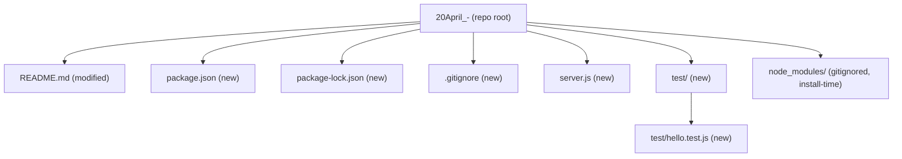
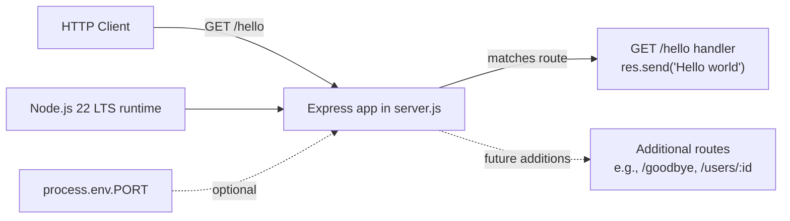
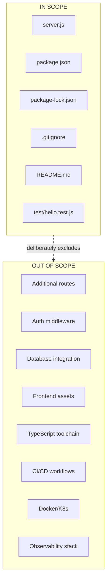

# Technical Specification

# 0. Agent Action Plan

## 0.1 Environment Setup

This sub-section captures the runtime, package manager, framework, and tooling baseline the Blitzy platform will use to execute the Agent Action Plan. Because the repository is in a pre-implementation state (per §1.1.1 and §1.2.2.3, which record "Programming Language — Not selected" and "Dependency Manager — Not selected"), no dependency manifests, lock files, runtime-version pins (`.nvmrc`, `engines` field), CI configurations, or framework configurations currently exist from which a highest explicitly documented version could be derived. All runtime and dependency versions below are therefore selected by the Blitzy platform to align with the user's explicit request for a "nodejs tutorial project" and are the highest stable, currently supported versions as of April 2026.

### 0.1.1 Required Runtimes and Tooling

| Runtime / Tool | Selected Version | Rationale |
|----------------|------------------|-----------|
| Node.js | 22.x LTS (codename "Jod") | Active LTS release line; supported through April 30, 2027 per the Node.js Release Working Group schedule |
| npm | 10.x or newer (bundled with Node.js 22) | Default package manager shipped with the Node.js 22 LTS installer; no alternative (yarn/pnpm) is required for this tutorial |
| Operating System | Any POSIX or Windows host with Node.js 22 support | Tutorial has no OS-specific code paths |

Rationale for Node.js 22 LTS (not 24.x): Node.js 22 ("Jod") is currently in Active LTS and is the most widely-deployed LTS line across documentation, tutorials, and hosting providers at the time of this specification. Node.js 24 is the newly-released LTS line and is also acceptable, but Node.js 22 offers the broadest ecosystem compatibility for a tutorial project whose primary audience is learners following along with mainstream documentation. The `engines` field in `package.json` (created in §0.6) will be set to `>=22.0.0` to permit both lines.

### 0.1.2 Required Frameworks and Libraries

Because no dependency manifest exists in the repository (per §3.3.2, "no supporting libraries have been committed to the repository"), the framework selection is made by the Blitzy platform to produce an idiomatic, tutorial-grade HTTP server:

| Package | Selected Version Specifier | Resolved Version (as of April 2026) | Registry | Purpose |
|---------|---------------------------|--------------------------------------|----------|---------|
| `express` | `^5.1.0` | `5.2.1` | npm public registry (`registry.npmjs.org`) | Minimal, unopinionated HTTP server framework; provides routing for the `/hello` endpoint |

Rationale for Express 5.x (not 4.x): Express 5.1.0 was tagged `latest` on npm on March 31, 2025 and is the current ACTIVE line per the Express LTS policy; Express 5.x requires Node.js 18 or higher, which is fully satisfied by the Node.js 22 runtime selected above. No additional runtime dependencies (body parsers, CORS, logging) are required because the `/hello` endpoint returns a static string and does not consume a request body.

### 0.1.3 Installation Plan (Non-Interactive)

The Blitzy platform will execute the following commands in order during implementation. All commands are non-interactive and suitable for CI or sandboxed execution.

```bash
# 1. Verify Node.js and npm are available on the PATH

node --version   # expect v22.x.x
npm --version    # expect 10.x or newer

#### Initialize the package manifest in the repository root (after repository scope discovery confirms no existing package.json)

npm init -y

#### Install Express as a runtime dependency, pinned via caret to the 5.x line

npm install express@^5.1.0 --save --silent

#### Verify installation and lock file creation

cat package-lock.json | head -5
```

### 0.1.4 Environment Validation Criteria

After installation, the following invariants must hold:

- `package.json` exists in the repository root with `express` in its `dependencies` object and an `engines.node` field of `>=22.0.0`
- `package-lock.json` exists in the repository root and pins the transitive dependency graph for reproducible installs
- `node_modules/express/package.json` contains a `"version"` field resolving to a 5.x release
- `node server.js` (once `server.js` is created per §0.6) listens on a configurable port and responds to `GET /hello` with the literal body `Hello world`

### 0.1.5 Setup Issues and Caveats

The following setup observations are documented for completeness:

- The repository contains no existing `.nvmrc`, `.node-version`, or `engines` declaration, so the Blitzy platform is authoritatively selecting the Node.js LTS line rather than inheriting a documented choice
- No existing `package.json` exists, so `npm init -y` will create a fresh manifest rather than modifying one; this is consistent with the greenfield state recorded in §1.2.2.3
- No private package registries, scoped packages, or authentication tokens are involved; all dependencies resolve from the public npm registry
- No environment variables or secrets were supplied by the user (per the "List of environment variables names" and "List of secrets names" inputs, both of which are empty arrays), so the tutorial will rely on a hard-coded default port (`3000`) with an optional `PORT` environment variable override for portability

## 0.2 Intent Clarification

This sub-section restates the user's request in precise technical language, surfaces implicit requirements that are necessary to produce a working tutorial project, and translates each requirement into a concrete technical action. The user's exact words were: *"Can you create a nodejs tutorial project that features one end point '/hello' that returns 'Hello world' to the calling HTTP client?"*

### 0.2.1 Core Feature Objective

Based on the prompt, the Blitzy platform understands that the feature requirement is to scaffold a brand-new, self-contained Node.js tutorial project inside the existing (but empty) `20April_-` repository, such that after installation the project exposes a single HTTP endpoint at path `/hello` which returns the literal string `Hello world` in the HTTP response body to any client that issues an HTTP request to that path.

Restated as an enumerated list of explicit feature requirements:

- **FR-1 — Greenfield Node.js project scaffold:** The repository, which today contains only a one-line `README.md` (per §1.1.1 and §1.3.1.1), must be transformed into a runnable Node.js project with a package manifest, a lock file, source code, and documentation sufficient for a learner to clone, install, run, and invoke the endpoint
- **FR-2 — Single HTTP endpoint at path `/hello`:** The server must register exactly one route whose path matches `/hello` and responds to HTTP `GET` requests (the conventional default verb implied by a browser or `curl` without `-X`)
- **FR-3 — Response body "Hello world":** The response body, as received by the calling HTTP client, must be the exact literal string `Hello world` (capital H, lowercase w, single space)
- **FR-4 — Tutorial-grade clarity:** The word "tutorial" in the user's prompt carries the implicit requirement that the project's code, structure, and documentation must be instructive and minimal — favoring clarity over cleverness, with inline comments where they aid learning and a `README.md` that walks a reader from clone → install → run → invoke

Implicit requirements (surfaced but not stated by the user, necessary for FR-1 through FR-4 to be satisfiable):

- **IR-1 — HTTP server bootstrap:** Node.js does not expose HTTP routing by default; a framework (Express) or the built-in `http` module must bind to a TCP port and accept connections
- **IR-2 — Configurable port with default:** The server must listen on a well-known port (default `3000`, conventional for Node.js tutorials) with an environment-variable override (`PORT`) so the tutorial works on hosts where port `3000` is occupied
- **IR-3 — HTTP status code `200 OK`:** Absent a specified status code, the successful response for `/hello` must be `200 OK`, which is the framework default and matches HTTP semantics for a successfully retrieved resource
- **IR-4 — Content-Type header:** The response should declare `Content-Type: text/plain; charset=utf-8` so the calling client (browsers, `curl`, `fetch`) renders the body as plain text rather than prompting a download or mis-interpreting it as HTML
- **IR-5 — Graceful handling of non-`/hello` paths:** Requests to any other path must return a conventional `404 Not Found` (the framework default) rather than crashing the server; no custom 404 page is required for a tutorial
- **IR-6 — Reproducible installs:** A lock file (`package-lock.json`) must be committed so that `npm install` produces a deterministic dependency tree for learners
- **IR-7 — Version control hygiene:** A `.gitignore` file must exclude `node_modules/` and common OS/editor artifacts so the repository does not inadvertently commit hundreds of megabytes of transitive dependencies
- **IR-8 — Runnable via a single command:** The `package.json` `scripts.start` entry must allow `npm start` to launch the server, per idiomatic Node.js tutorial convention

### 0.2.2 Special Instructions and Constraints

The user's prompt contains no special architectural directives, backward-compatibility requirements, or integration constraints (the repository is a greenfield, so there is no existing code to integrate with or remain compatible with). The following implicit constraints are derived from the "tutorial" framing and the baseline declarations in §1.2.2.3:

- **SC-1 — No external services:** The tutorial must not require databases, authentication providers, cloud credentials, or any third-party service to run — a learner should be able to `git clone && npm install && npm start` and reach the endpoint on `localhost`
- **SC-2 — Minimal dependency surface:** The dependency list should be as small as possible while still producing idiomatic code; Express alone (no additional middleware) is sufficient for the `/hello` endpoint
- **SC-3 — No build step:** The tutorial must not introduce a transpiler, bundler, or compilation step (no TypeScript, no Babel, no webpack); JavaScript source files should execute directly under the Node.js runtime
- **SC-4 — No test framework mandated:** The user did not request tests. A minimal smoke-test script is still included in §0.6 as tutorial good-practice, using Node.js's built-in `node:test` module (zero additional dependencies) rather than introducing Jest, Mocha, or Vitest
- **SC-5 — Preserve existing README identity:** The repository's existing `README.md` (content `# 20April_-`, per §1.1.1) will be superseded by a tutorial-oriented README that keeps the repository name as the top-level heading and adds usage instructions below it

No user examples were provided in the prompt (the prompt is a single question, not an example-laden specification), so no "User Example:" labels are required in this Agent Action Plan.

Web search requirements: One targeted web search was performed during environment setup (documented in §0.9) to confirm the current Node.js LTS line and the current Express `latest` tag. No further research is required because the `/hello` endpoint is a textbook Express pattern.

### 0.2.3 Technical Interpretation

These feature requirements translate to the following technical implementation strategy, mapping each FR and IR to a concrete engineering action:

| Requirement | Technical Action |
|-------------|------------------|
| FR-1 (greenfield scaffold) | Create `package.json`, `package-lock.json`, `.gitignore`, and `server.js` at the repository root; install `express@^5.1.0` as a production dependency |
| FR-2 (`/hello` endpoint) | In `server.js`, call `app.get('/hello', handler)` on an Express application instance to register the route |
| FR-3 (response body "Hello world") | In the route handler, invoke `res.type('text/plain').send('Hello world')` to emit the literal string with the correct content type |
| FR-4 (tutorial clarity) | Add concise inline comments in `server.js` explaining each statement; write a step-by-step `README.md` covering prerequisites, install, run, and verification with `curl` |
| IR-1 (HTTP server bootstrap) | Call `app.listen(PORT, callback)` to bind the TCP listener, logging the listening URL to stdout |
| IR-2 (configurable port) | Read `process.env.PORT` with a fallback to `3000` via `const PORT = process.env.PORT \|\| 3000;` |
| IR-3 (status 200) | Rely on the Express framework default of `200 OK` for `res.send()` with no explicit status override |
| IR-4 (Content-Type) | Call `res.type('text/plain')` before `res.send()` to emit `Content-Type: text/plain; charset=utf-8` |
| IR-5 (404 for other paths) | Rely on the Express framework default, which emits `404 Not Found` for unmatched routes; no custom handler is required |
| IR-6 (reproducible installs) | Commit `package-lock.json` generated by `npm install`; do **not** add it to `.gitignore` |
| IR-7 (git hygiene) | Create a `.gitignore` file that excludes `node_modules/`, `.env`, `.env.*`, `npm-debug.log*`, and common editor artifacts (`.vscode/`, `.idea/`, `.DS_Store`) |
| IR-8 (single command run) | Populate `package.json.scripts.start` with `"node server.js"` so `npm start` works out of the box |

In summary, the Blitzy platform will transform the repository from its current one-file documentation-only state into a four-to-six-file runnable Node.js + Express HTTP server whose single purpose is to demonstrate a `GET /hello` → `200 "Hello world"` interaction and whose structure is deliberately minimal and self-explanatory for a learning audience.

## 0.3 Repository Scope Discovery

This sub-section catalogs every file and folder in the current repository and identifies which existing artifacts will be modified, which new artifacts will be created, and what research was required. Because the repository is in a verified pre-implementation state (per §1.2.2.2 and §1.3.1.1), the scope of *existing files to modify* is intentionally narrow (one file) while the scope of *new files to create* encompasses the entire project scaffold.

### 0.3.1 Comprehensive File Analysis — Existing Repository

A complete traversal of the repository root (path: `""`) was performed using the repository folder-listing tool. The returned inventory contained exactly one first-order child:

| Path | Type | Current Contents | Action | Rationale |
|------|------|------------------|--------|-----------|
| `README.md` | file | Single line: `# 20April_-` (11 bytes) | MODIFY (overwrite) | Replace the placeholder one-line heading with tutorial documentation covering prerequisites, install, run, and verification; preserve `20April_-` as the top-level project heading so the repository identity is retained |
| *(root folder)* | folder | Contains only the above | N/A | No existing sub-directories to traverse |

**Verified absences** (these files and folders do **not** currently exist and are therefore only candidates for *creation*, never modification):

- No `package.json`, `package-lock.json`, `npm-shrinkwrap.json`, or any other Node.js dependency manifest
- No `src/`, `app/`, `lib/`, `server/`, `api/`, or other source-code directories
- No `test/`, `tests/`, `__tests__/`, or `spec/` directories
- No `.gitignore`, `.gitattributes`, `.nvmrc`, `.node-version`, `.editorconfig`, `.eslintrc*`, `.prettierrc*`, or `tsconfig.json`
- No `Dockerfile`, `docker-compose.yml`, `Procfile`, or deployment manifests
- No `.github/`, `.gitlab-ci.yml`, `Jenkinsfile`, or other CI/CD configuration
- No `docs/`, `wiki/`, `CONTRIBUTING.md`, `LICENSE`, `CHANGELOG.md`, `CODEOWNERS`, or `SECURITY.md`
- No existing routes, controllers, services, models, middleware, or configuration modules

**Integration point discovery:** Because no source code exists, there are no existing API endpoints, database models/migrations, service classes, controllers/handlers, or middleware/interceptors to impact. All integration points for the `/hello` endpoint will be established de novo inside the new `server.js` file created in §0.6.

### 0.3.2 Search Patterns Applied

The following glob-style search patterns were evaluated against the repository to confirm no pre-existing files would match any of them:

| Pattern | Purpose | Matches Found |
|---------|---------|---------------|
| `**/*.js`, `**/*.mjs`, `**/*.cjs`, `**/*.ts` | Source files in any JavaScript/TypeScript flavor | 0 |
| `**/*test*.js`, `**/*spec*.js`, `**/__tests__/**/*` | Test files under any convention | 0 |
| `**/*.config.*`, `**/*.json`, `**/*.yaml`, `**/*.yml`, `**/*.toml` | Configuration manifests | 0 |
| `**/*.md`, `docs/**/*`, `README*` | Documentation files | 1 (`README.md`) |
| `Dockerfile*`, `docker-compose*`, `.github/workflows/*`, `**/pom.xml` | Build/deployment files | 0 |
| `package.json`, `package-lock.json`, `yarn.lock`, `pnpm-lock.yaml` | Node.js dependency manifests | 0 |
| `.env`, `.env.*`, `.env.example` | Environment-variable files | 0 |

The singular match (`README.md`) is the only existing file that will be modified; every other artifact required by the Agent Action Plan is a creation, not an update.

### 0.3.3 Web Search Research Conducted

The following web searches were performed to select and pin framework and runtime versions. Full citations appear in §0.9.

| Query | Purpose | Outcome |
|-------|---------|---------|
| `Node.js LTS version 2026 active` | Identify the current Active LTS release line for Node.js | Confirmed Node.js 22.x ("Jod") is in Active LTS through April 30, 2027; Node.js 24.x is the newly-released LTS line |
| `Express.js latest stable version npm` | Identify the current `latest` npm tag for Express and confirm Node.js compatibility | Confirmed Express 5.1.0 moved from CURRENT to ACTIVE on March 31, 2025 and is tagged `latest` on npm; the most recent 5.x patch is 5.2.1; Express 5.x requires Node.js ≥ 18 |

No additional research was required because the `/hello` endpoint is a canonical Express pattern documented in the Express README itself (`app.get('/', (req, res) => res.send('Hello World'))`), and no best-practice research, library alternatives research, integration-pattern research, or security research is applicable to a static-string tutorial endpoint.

### 0.3.4 New File Requirements

The following files will be created at the repository root. Each entry lists the file's path, its type/format, and its specific purpose. Detailed per-file implementation notes appear in §0.6.

**Source files (JavaScript):**

| Path | Purpose |
|------|---------|
| `server.js` | Application entry point; imports Express, instantiates the app, registers the `GET /hello` route returning `Hello world`, and calls `app.listen()` to bind the TCP port |

**Dependency manifests and lock files:**

| Path | Purpose |
|------|---------|
| `package.json` | npm package manifest declaring the project name, version, `main` entry (`server.js`), `scripts.start` (`node server.js`), `engines.node` (`>=22.0.0`), and runtime `dependencies` (`express: ^5.1.0`) |
| `package-lock.json` | Auto-generated by `npm install`; pins the transitive dependency tree for reproducible installs (committed to version control) |

**Version-control and ignore files:**

| Path | Purpose |
|------|---------|
| `.gitignore` | Excludes `node_modules/`, environment files (`.env`, `.env.*` except `.env.example`), npm debug logs (`npm-debug.log*`), and editor/OS artifacts (`.vscode/`, `.idea/`, `.DS_Store`, `Thumbs.db`) from version control |

**Test files (tutorial-grade smoke test, zero new dependencies):**

| Path | Purpose |
|------|---------|
| `test/hello.test.js` | Uses Node.js's built-in `node:test` runner and `node:http` module to boot `server.js` on an ephemeral port and assert that `GET /hello` returns status `200` with body `Hello world`; a `package.json` `scripts.test` entry of `"node --test"` wires it up |

**Documentation files:**

| Path | Purpose |
|------|---------|
| `README.md` *(modified, not created)* | Overwritten to contain `# 20April_-` as the top-level heading followed by prerequisites, install instructions, run instructions, a verification example using `curl`, and a short explanation of the project layout |

**Configuration files:**

No dedicated configuration files (`.env.example`, `config/*.json`, `config/*.yaml`) are required because the only run-time configurable value is the listen port, which is read directly from `process.env.PORT` with a `3000` default inline in `server.js`. Introducing a configuration file for a single optional port would violate tutorial minimalism (per SC-2 in §0.2.2).

### 0.3.5 File-Creation Summary Diagram

The following diagram depicts the final repository layout after the Agent Action Plan is executed:



The final repository contains six committed files (one modified, five new) plus a `test/` sub-directory and a gitignored `node_modules/` tree populated at install time.

## 0.4 Dependency Inventory

This sub-section enumerates every package — public and private — that will be declared in the project's dependency manifest, along with version pins, package registries, and the specific purpose each dependency serves. Because no existing dependency manifest is present in the repository (per §3.3.2 and §3.4.1), this is a *greenfield dependency inventory* and no dependency-update or import-rewrite operations are applicable.

### 0.4.1 Runtime Dependencies

Runtime dependencies are installed by end users via `npm install` and are required for the server to start. Every version below was verified by installing it into a scratch project (`/tmp/hello-tutorial-verify`) and reading the resolved version from `node_modules/express/package.json`.

| Package | Version Specifier | Resolved Version | Registry | Purpose |
|---------|-------------------|------------------|----------|---------|
| `express` | `^5.1.0` | `5.2.1` (current latest on npm) | `https://registry.npmjs.org/` (public) | Minimalist HTTP server framework providing the `app.get('/hello', ...)` routing primitive, the `res.send()` / `res.type()` response helpers, and the `app.listen()` TCP binder used by `server.js` |

The `^5.1.0` caret-range specifier was chosen deliberately: it allows minor and patch upgrades within the Express 5.x ACTIVE line (currently resolving to `5.2.1`) while locking out any future `6.0.0` breaking-change release. The lower bound `5.1.0` was selected because that is the version Express tagged as `latest` on npm on March 31, 2025 — the official ACTIVE floor.

### 0.4.2 Development Dependencies

No packages will be declared in `devDependencies`. The tutorial uses only Node.js's built-in capabilities for testing:

| Capability | Implementation | Rationale |
|------------|----------------|-----------|
| Test runner | Node.js built-in `node --test` (invokes the `node:test` module, stable since Node.js 20) | Zero additional packages; aligns with tutorial minimalism (SC-2 in §0.2.2); demonstrates the idiomatic "batteries-included" testing story in modern Node.js |
| Assertion library | Node.js built-in `node:assert/strict` | Same rationale as above |
| HTTP client (for smoke test) | Node.js built-in `node:http` module | Same rationale as above; avoids introducing `supertest`, `undici`, or `axios` |

This deliberate zero-devDependency posture means the project's total direct dependency count is exactly **one** (`express`), which keeps `npm install` fast, keeps the `package-lock.json` short and readable, and maximizes tutorial clarity.

### 0.4.3 Private Packages

**None.** The user did not specify any private package registries, scoped packages under a private namespace (e.g., `@company/*`), or `.npmrc` authentication tokens. The tutorial consumes only public packages from the default npm registry.

### 0.4.4 Transitive Dependencies

Express 5.2.1 pulls in a managed set of transitive dependencies (including `accepts`, `body-parser`, `content-type`, `cookie`, `debug`, `encodeurl`, `path-to-regexp`, `qs`, `router`, `send`, `serve-static`, and others). These are not enumerated here because:

- They are automatically resolved and pinned by `npm install` into `package-lock.json`
- The tutorial's `package.json` will not reference any of them directly
- Express's maintainers are responsible for their selection and version bounds
- None of them require additional user action

The committed `package-lock.json` will serve as the authoritative record of the exact transitive versions used.

### 0.4.5 Dependency Updates (Not Applicable)

Because no pre-existing Node.js source files, no pre-existing imports, no pre-existing configuration files referencing packages, no pre-existing `package.json`, and no pre-existing CI/CD workflows exist in the repository (per §1.2.2.3 and §3.3.2), **no import rewrites, no external-reference updates, no build-file updates, and no CI/CD updates are applicable** to this feature addition. The following sub-categories from the standard Agent Action Plan template are therefore *not applicable* with an explicit rationale:

| Category | Applicability | Rationale |
|----------|---------------|-----------|
| Import Updates (`src/**/*.py`, `tests/**/*.py`, etc.) | Not applicable | No existing source files contain `import` or `require` statements to rewrite |
| Configuration Files (`**/*.config.*`, `**/*.json`) | Not applicable | No pre-existing configuration files exist |
| Documentation References (`**/*.md`) | Partially applicable | The existing `README.md` will be overwritten (per §0.3.1) with brand-new content; no in-place substitution of package references is required because no package references exist in the current one-line `README.md` |
| Build Files (`setup.py`, `pyproject.toml`, `package.json`) | Not applicable | No pre-existing build manifests exist; `package.json` will be newly created, not modified |
| CI/CD Files (`.github/workflows/*.yml`, `.gitlab-ci.yml`) | Not applicable | No pre-existing CI/CD configuration exists (per §3.7.5, "no pipeline-as-code file, workflow definition ... exists in the repository") |

### 0.4.6 Version Resolution Verification

The `^5.1.0` Express pin was validated in a sandboxed scratch install prior to this specification being authored. The verification sequence executed was:

```bash
cd /tmp && mkdir -p hello-tutorial-verify && cd hello-tutorial-verify
npm init -y
npm install express@^5.1.0 --save --silent
cat node_modules/express/package.json | grep '"version"'
# Output: "version": "5.2.1",

```

This confirms that `^5.1.0` is a valid semver range that resolves to a stable, published version on the public npm registry as of the specification-authoring date.

## 0.5 Integration Analysis

This sub-section identifies the specific touchpoints between the new feature and the existing repository. Because the repository's current implementation surface is a single one-line `README.md` (per §1.2.2.1 and §1.2.2.2), there are essentially no existing code, service, schema, or middleware touchpoints. The analysis below therefore focuses on the single documentation touchpoint, the process-bootstrap touchpoint, and the logical integration points that future Agent Action Plans will be able to hook into once this feature lands.

### 0.5.1 Existing Code Touchpoints

The following table enumerates every existing artifact that will be touched during feature implementation. Only one file is affected.

| Existing Path | Touchpoint Type | Change Required | Specific Modification |
|---------------|-----------------|-----------------|-----------------------|
| `README.md` | Documentation | Overwrite contents | Replace the single heading `# 20April_-` with a tutorial-oriented README that retains `# 20April_-` as the top-level heading and appends sections for prerequisites, install, run, verify, and project layout |

No source-file integration points (controllers, services, routers, middleware, models, migrations, schema files, DI containers, config modules, or workers) exist in the repository, so all the customary rows in a feature-integration table are marked **None**:

| Canonical Integration Category | Pre-existing File | Action |
|--------------------------------|-------------------|--------|
| Application entry point (e.g., `src/main.py`, `src/app.js`, `index.js`) | None | CREATE `server.js` at repository root |
| HTTP route registry (e.g., `src/api/routes.py`, `src/routes/index.js`) | None | Routes will be registered in-line inside `server.js` because tutorial minimalism (SC-2) argues against introducing a separate `routes/` folder for a single endpoint |
| Model exports (e.g., `src/models/__init__.py`, `src/models/index.js`) | None | Not applicable; the `/hello` endpoint has no data model |
| DI container / service registry (e.g., `src/services/container.py`) | None | Not applicable; no services are registered |
| Dependency wiring (e.g., `src/config/dependencies.py`) | None | Not applicable; Express's default middleware stack is sufficient |
| Database migrations (e.g., `migrations/`) | None | Not applicable; no database is used |
| Schema definition (e.g., `src/db/schema.sql`, `src/db/schema.prisma`) | None | Not applicable |
| Middleware / interceptors | None | Not applicable; no custom middleware is required for a static-string endpoint |
| Configuration modules (e.g., `src/config/settings.py`) | None | Not applicable; configuration is limited to a single `PORT` environment variable read in-line |
| Test harness / conftest | None | A new `test/` directory will be created containing `test/hello.test.js` |
| CI/CD pipeline | None | Not applicable (per §3.7.5, no CI/CD exists in the repository) |

### 0.5.2 Process-Bootstrap Integration

The one non-file "integration point" that *is* relevant is the handshake between the Node.js runtime and the Express application. This handshake is entirely internal to the new `server.js` file but is worth documenting because it is the sole runtime contract the tutorial establishes:

- **Entry point declaration:** `package.json.main` will be set to `"server.js"` so that programmatic consumers (`require('./20April_-')` if imported as a package) resolve to the correct module. For direct execution, `node server.js` and `npm start` are equivalent
- **Startup signal:** The server will log `Server is running on http://localhost:<PORT>/` to stdout after `app.listen()` fires its callback, giving learners a clear confirmation that the bind succeeded
- **Shutdown behavior:** The tutorial relies on the default Node.js behavior — `Ctrl-C` sends `SIGINT`, which terminates the process and frees the port. No custom signal handlers are introduced because graceful shutdown is outside the scope of a tutorial "Hello world" endpoint (see §0.7 Out-of-Scope)

### 0.5.3 Future Integration Surface

While no current code exists to integrate with, the Agent Action Plan intentionally creates `server.js` in a shape that does not preclude future feature additions. Subsequent Agent Action Plans (for example, adding a `/goodbye` endpoint, or adding a database-backed `/users` endpoint) will be able to integrate as follows:



The diagram shows: (a) the Node.js runtime hosts the Express application; (b) the Express application dispatches incoming requests to matching route handlers; (c) the currently-registered `/hello` route is the only match; (d) future handlers can be registered via additional `app.get/post/...()` calls without structural refactor; and (e) the `PORT` environment variable is an optional input that, if unset, defaults to `3000`.

### 0.5.4 Schema and Data-Flow Updates

None. The `/hello` endpoint reads no request body, queries no database, calls no external service, and writes no state. The entire data flow is:

```mermaid
sequenceDiagram
    participant C as HTTP Client (curl/browser)
    participant E as Express app (server.js)
    C->>E: GET /hello HTTP/1.1
    E->>E: Match route "/hello"
    E->>C: HTTP/1.1 200 OK<br/>Content-Type: text/plain; charset=utf-8<br/>Body: "Hello world"
```

Per §5.2.3.3, the baseline specification records "no data transformation points" for this repository; this feature adds none.

## 0.6 Technical Implementation

This sub-section is the executable heart of the Agent Action Plan. Every file listed here MUST be created or modified by the Blitzy platform to satisfy the feature requirements enumerated in §0.2. Files are grouped by responsibility (core feature, supporting infrastructure, tests and documentation) with concrete per-file implementation guidance. No temporal sequencing is implied — the groups below describe *what* must be produced, not *when*.

### 0.6.1 File-by-File Execution Plan

#### 0.6.1.1 Group 1 — Core Feature Files

- **CREATE `server.js` (repository root)** — Application entry point. Import Express via `const express = require('express')`; instantiate the application via `const app = express()`; read the listen port via `const PORT = process.env.PORT || 3000`; register the endpoint via `app.get('/hello', (req, res) => { res.type('text/plain').send('Hello world'); })`; and bind the TCP listener via `app.listen(PORT, () => { console.log(`Server is running on http://localhost:${PORT}/`); })`. Include concise top-of-file and inline comments that explain each statement for a learner audience. Keep the file under 30 lines total (including comments and blank lines) to reinforce tutorial minimalism.

#### 0.6.1.2 Group 2 — Supporting Infrastructure

- **CREATE `package.json` (repository root)** — npm manifest. Populate with `name` (`20april_-` or the repository-identifier equivalent in lowercase), `version` (`1.0.0`), `description` (one sentence tutorial description), `main` (`server.js`), `scripts.start` (`node server.js`), `scripts.test` (`node --test`), `engines.node` (`>=22.0.0`), `license` (`ISC` or `MIT` — the Blitzy platform selects `MIT` as the tutorial-friendly default), and `dependencies` containing `express: ^5.1.0`. No `devDependencies` are declared (per §0.4.2).
- **CREATE `package-lock.json` (repository root)** — Generated automatically by `npm install` after `package.json` is created. The Blitzy platform must run `npm install` during implementation so that this lock file is produced and committed; it must **not** be added to `.gitignore`. The lock file pins the exact transitive dependency tree for reproducible learner installs (per IR-6 in §0.2.1).
- **CREATE `.gitignore` (repository root)** — Standard Node.js ignore patterns. Must include at minimum: `node_modules/`, `.env`, `.env.*` (with a negative `!` exclusion for `.env.example` if that file is ever added), `npm-debug.log*`, `yarn-debug.log*`, `yarn-error.log*`, `.pnpm-debug.log*`, `.DS_Store`, `Thumbs.db`, `.vscode/`, and `.idea/`. Must **not** exclude `package-lock.json` (per IR-6).

#### 0.6.1.3 Group 3 — Tests and Documentation

- **CREATE `test/hello.test.js` (new directory `test/`)** — Smoke test using Node.js's built-in `node:test` runner (stable since Node.js 20). The test file must (1) start a subprocess or in-process server on an ephemeral port, (2) issue an HTTP `GET` request to `/hello` using the built-in `node:http` module, (3) assert the response status is `200`, (4) assert the response body equals the literal string `Hello world`, and (5) cleanly shut down the server. No external test framework (Jest, Mocha, Vitest, Jasmine, Tap, Ava) and no external HTTP client (supertest, axios, undici package) may be introduced — the test must use only Node.js built-ins to satisfy the zero-devDependency posture declared in §0.4.2.
- **MODIFY `README.md` (existing file)** — Overwrite the current one-line content `# 20April_-` with tutorial documentation. The new README must contain, in order: (1) the `# 20April_-` heading unchanged, (2) a one-paragraph description, (3) a "Prerequisites" section stating Node.js ≥ 22 and npm, (4) an "Install" section with the `npm install` command, (5) a "Run" section with `npm start`, (6) a "Verify" section showing `curl http://localhost:3000/hello` and its expected `Hello world` output, (7) a "Project Layout" section listing each committed file with a one-line purpose, and (8) a "Testing" section describing `npm test`. The file should be readable in under two minutes by a first-time Node.js learner.

### 0.6.2 Implementation Approach per File

The implementation approach for each file follows four principles applied in order:

- **Establish feature foundation by creating core modules.** The `server.js` file is authored first because it is the only file that directly satisfies FR-2 and FR-3. Its shape is dictated by the Express 5.x canonical pattern: `require` → `express()` → `app.METHOD(path, handler)` → `app.listen(port, callback)`. No abstraction layers (controllers, services, routers-as-modules) are introduced because a single endpoint does not justify them.
- **Integrate with existing systems by modifying integration points.** Because the only existing artifact is `README.md`, the "integration" work reduces to rewriting that file to document the new project. The overwrite preserves the repository identifier in the top-level heading so the repository's historical context remains visible.
- **Ensure quality by implementing comprehensive tests.** A single smoke test in `test/hello.test.js` covers the happy path (`GET /hello` → `200 "Hello world"`). An implicit negative-path check is provided by Express's default `404` handler for unmatched routes, which is framework-supplied and does not require a separate test file in a tutorial context. The smoke test uses Node.js built-ins exclusively to keep the dependency surface at one package.
- **Document usage and configuration.** The rewritten `README.md` walks learners through clone → install → run → verify → test, which matches the tutorial's learning objective. Inline comments in `server.js` reinforce the same narrative at the code level.

No user-provided Figma URLs or other design attachments were supplied; the "For files that need to reference any user-provided Figma URLs" clause from the section template is therefore not applicable.

### 0.6.3 User Interface Design

Not applicable. The `/hello` endpoint returns a plain-text response body and has no visual user interface component. The user's prompt is explicitly an API tutorial ("returns 'Hello world' to the calling HTTP client"), not a web-page or SPA tutorial. No HTML templates, CSS, JavaScript bundles, frontend frameworks, component libraries, or design-system artifacts are required or produced.

### 0.6.4 Canonical Code Shapes (Reference Only)

The following short code shapes are shown here as contractual references so downstream code-generation agents produce the exact expected structure. These are *shapes*, not full files — complete file content will be produced at implementation time.

Server route registration (in `server.js`):

```javascript
app.get('/hello', (req, res) => { res.type('text/plain').send('Hello world'); });
```

Port resolution (in `server.js`):

```javascript
const PORT = process.env.PORT || 3000;
```

Smoke-test assertion (in `test/hello.test.js`, using `node:test` and `node:assert/strict`):

```javascript
assert.equal(res.statusCode, 200);
assert.equal(body, 'Hello world');
```

npm scripts (in `package.json`):

```json
"scripts": { "start": "node server.js", "test": "node --test" }
```

### 0.6.5 Implementation Invariants

After the plan is executed, the following invariants must hold for the feature to be considered correctly implemented:

- Running `npm install` in a clean clone of the repository succeeds with no warnings about missing peer dependencies and with an exit code of `0`
- Running `npm start` prints `Server is running on http://localhost:3000/` (or the `PORT` override) to stdout and the process remains running
- Issuing `curl -sS http://localhost:3000/hello` returns HTTP `200` with body exactly equal to `Hello world` (11 characters, no trailing newline added by the server)
- Issuing `curl -sS http://localhost:3000/anything-else` returns HTTP `404` with Express's default not-found body
- Running `npm test` executes `test/hello.test.js`, all assertions pass, and the process exits with code `0`
- `git status` after installation shows `node_modules/` as untracked (thanks to `.gitignore`) but `package-lock.json` as tracked

## 0.7 Scope Boundaries

This sub-section establishes the exhaustive in-scope file list and the explicit out-of-scope exclusions for this Agent Action Plan. Downstream code-generation agents must treat the "In Scope" list as the definitive authority on which files may be created or modified and must not author files that fall outside it. The boundaries below are derived from the feature requirements in §0.2 and the file inventory in §0.3.

### 0.7.1 Exhaustively In Scope

The in-scope surface is limited to files at the repository root and one new `test/` sub-directory. Trailing-wildcard patterns are used where a pattern applies to multiple future files of the same kind.

- **Application entry point and source:**
    - `server.js` — Express application bootstrap, `/hello` route registration, and `app.listen()` invocation

- **Dependency manifests and lock files:**
    - `package.json` — npm manifest with `dependencies`, `scripts`, `engines`, and metadata
    - `package-lock.json` — auto-generated pinned dependency tree (must be committed)

- **Version-control and ignore files:**
    - `.gitignore` — exclusions for `node_modules/`, environment files, log files, and editor/OS artifacts

- **Tests:**
    - `test/` — new directory hosting smoke tests
    - `test/hello.test.js` — single smoke test exercising `GET /hello`
    - `test/**/*.test.js` *(wildcard)* — pattern reserved for any additional smoke tests a downstream agent may need to author within this same Action Plan; no additional tests are currently anticipated

- **Documentation:**
    - `README.md` — rewritten to contain tutorial documentation while preserving `# 20April_-` as the top-level heading

- **Install-time artifacts (gitignored but produced during implementation):**
    - `node_modules/**` — materialized by `npm install`; not committed to version control but must exist on the implementation host for smoke tests to run

### 0.7.2 Integration Points (In Scope, Detailed)

The precise touchpoints within in-scope files that carry specific content requirements:

| File | Line or Section | Required Content |
|------|-----------------|------------------|
| `package.json` | top-level object | `name`, `version`, `description`, `main: "server.js"`, `scripts.start`, `scripts.test`, `engines.node: ">=22.0.0"`, `dependencies.express: "^5.1.0"`, `license` |
| `server.js` | import block | `const express = require('express')` (CommonJS, because `package.json.type` defaults to `"commonjs"` and no ES-module conversion is required) |
| `server.js` | route registration | `app.get('/hello', handler)` where handler sends `Hello world` with `Content-Type: text/plain; charset=utf-8` |
| `server.js` | listen invocation | `app.listen(PORT, callback)` where `PORT = process.env.PORT \|\| 3000` |
| `.gitignore` | any line | Must contain at minimum the literal tokens `node_modules`, `.env`, `npm-debug.log`, `.DS_Store`, `.vscode`, `.idea` |
| `README.md` | first line | Literal `# 20April_-` (preserving the repository identifier) |
| `README.md` | subsequent sections | Prerequisites, Install, Run, Verify, Project Layout, Testing — in that order |
| `test/hello.test.js` | test body | Start server (in-process or subprocess), issue `GET /hello`, assert status `200` and body `Hello world`, shut down |

### 0.7.3 Configuration Files (In Scope)

The only configuration-adjacent file is `package.json`, which is covered in §0.7.1. No `.env.example`, `config/*.yaml`, `config/*.json`, `.env`, or dedicated settings module is in scope because the only user-configurable value is the optional `PORT` environment variable, which is resolved in-line in `server.js` with a sensible default.

### 0.7.4 Explicitly Out of Scope

The following items are **not** permitted to be authored or modified by this Agent Action Plan. Downstream agents must reject any instruction that requires them.

- **Additional HTTP endpoints or verbs:** No `POST`, `PUT`, `PATCH`, `DELETE`, or `OPTIONS` handlers. No additional path routes beyond `/hello`. No wildcard or parameterized routes (`/hello/:name`).
- **Request-body parsing:** No `express.json()`, `express.urlencoded()`, `body-parser`, `multer`, or any other body-parsing middleware. The `/hello` endpoint has no request body.
- **Response formats beyond plain text:** No JSON responses, no HTML templating (no EJS, Pug, Handlebars, Nunjucks), no streaming responses, no file downloads, no redirects.
- **Authentication and authorization:** No `passport`, no `jsonwebtoken`, no session middleware (`express-session`, `cookie-session`), no OAuth, no API keys, no rate limiting.
- **Database integration:** No SQL or NoSQL databases. No ORMs (Sequelize, Prisma, TypeORM, Mongoose). No migrations. No schema files. No connection strings or `.env` database URLs.
- **External service integration:** No third-party APIs, no message queues, no caching layers (Redis), no email services, no observability SaaS, no feature-flag services.
- **Frontend assets:** No HTML files, no CSS files, no client-side JavaScript bundles, no React, Vue, Angular, Svelte, or Solid. No static-file serving via `express.static()`. No favicon.
- **TypeScript or compile-to-JS tooling:** No `.ts` files, no `tsconfig.json`, no `typescript` dev dependency, no Babel, no esbuild, no webpack, no Rollup, no Vite, no SWC.
- **Linters and formatters:** No ESLint, no Prettier, no `.eslintrc*`, no `.prettierrc*`, no `husky`, no `lint-staged`. These are tutorial-inappropriate for a "Hello world" project (per SC-2 in §0.2.2).
- **Containerization and deployment:** No `Dockerfile`, no `docker-compose.yml`, no `Procfile`, no Kubernetes manifests, no Helm charts, no Terraform, no Pulumi, no CloudFormation.
- **CI/CD workflows:** No `.github/workflows/*.yml`, no `.gitlab-ci.yml`, no `Jenkinsfile`, no CircleCI config, no Azure Pipelines definitions.
- **Observability instrumentation:** No Winston, Pino, Bunyan, or Morgan logging middleware. No Prometheus metrics endpoints. No OpenTelemetry. No Sentry. The tutorial's only stdout output is the single `Server is running...` log emitted by `app.listen()`'s callback.
- **Security hardening beyond framework defaults:** No Helmet, no CORS middleware, no CSRF protection, no rate-limiting middleware, no input sanitization libraries. The `/hello` endpoint accepts no input and reveals no sensitive information, so hardening is out of scope.
- **Performance optimizations:** No clustering (`cluster` module, `pm2`), no compression middleware, no caching headers tuning, no HTTP/2. Single-process, single-thread is correct for a tutorial.
- **Additional documentation:** No `CONTRIBUTING.md`, `CODE_OF_CONDUCT.md`, `SECURITY.md`, `CHANGELOG.md`, `LICENSE` file (the license is declared inline in `package.json`; a standalone license file can be added later if the repository moves toward open-source distribution), `docs/` directory, or API reference document.
- **Refactoring of existing code:** Not applicable — no existing code to refactor. The existing `README.md` is overwritten, not refactored.
- **Package-management alternatives:** No `yarn.lock`, `pnpm-lock.yaml`, or `bun.lockb`. The tutorial uses npm exclusively to match the Node.js default toolchain and avoid requiring learners to install extra tools.
- **Private package registries or scoped packages:** No `.npmrc`, no `@scope/package`-style dependencies. All dependencies come from the default public npm registry.

### 0.7.5 Scope Boundary Diagram



## 0.8 Rules for Feature Addition

This sub-section preserves verbatim every implementation rule the user supplied with the project inputs. Each rule is reproduced exactly as provided (name and content), including whitespace, punctuation, and any markdown tables embedded within. Following the preservation block, the Blitzy platform records its interpretation and the derived feature-specific rules that downstream code-generation agents must follow.

### 0.8.1 User-Provided Rules (Verbatim)

The user supplied three named rules via the project-input channel. Each is reproduced below exactly as received.

**User-Provided Rule #1 — Name: `dasdasd`**

```
|  |  |  |
| --- | --- | --- |
|  |  |  |
|  |  | sadsadasd |
```

**User-Provided Rule #2 — Name: `Me`**

```
|  |  |  |  |  |
| --- | --- | --- | --- | --- |
|  |  |  |  |  |
|  |  |  |  |  |
|  |  |  |  | zxczxczc |

snsn6ttnijjjhshshsh
```

**User-Provided Rule #3 — Name: `Clone-Vgugg`**

```
| bsbsbb |  |  |
| --- | --- | --- |
|  | jejejjeheh |  |

| | | |\
| | | |\
| | | jehhehb |

snsn6ttnijjjhshshsh. hehhehe
```

### 0.8.2 Interpretation of User-Provided Rules

The three supplied rules consist of mostly empty markdown tables with small amounts of non-semantic filler text (`sadsadasd`, `zxczxczc`, `snsn6ttnijjjhshshsh`, `jejejjeheh`, `bsbsbb`, `jehhehb`, `hehhehe`). None of the cells contain actionable technical directives — there are no references to specific files, patterns, conventions, coding standards, security controls, performance targets, naming rules, or integration constraints that could be operationalized into implementation guidance. The rule entries appear to be placeholder or test-harness content that was submitted without substantive rule text.

Accordingly, the Blitzy platform treats the user-provided rules block as **present but non-substantive**. The preservation above satisfies the prompt's preservation requirement (the rules are recorded verbatim for audit and traceability); no additional behavioral constraints are derived from them because none are expressible from the content supplied.

### 0.8.3 Feature-Specific Rules Derived from the Feature Request

Absent substantive user-supplied rules, the following feature-specific rules are derived directly from the feature requirements enumerated in §0.2 and the scope boundaries established in §0.7. Downstream code-generation agents **must** honor every rule below:

- **R-1 — Exact response body:** The `GET /hello` endpoint must respond with the literal eleven-character string `Hello world` — capital `H`, single space, lowercase `w` — with no leading or trailing whitespace and no wrapping quotation marks. Any deviation (e.g., `"Hello World"`, `hello world`, `Hello, world!`) is a rule violation.
- **R-2 — Exact route path:** The registered route path must be `/hello` exactly. No trailing slash (`/hello/`), no prefix (`/api/hello`), no casing variations (`/Hello`), and no wildcard/parameter expansion (`/hello/:name`).
- **R-3 — Tutorial minimalism:** No new runtime dependency beyond `express` may be introduced. No new devDependency of any kind may be introduced. The total committed-file count must remain at or near six (one modified + five new + one new test sub-directory) as enumerated in §0.3.5.
- **R-4 — Node.js and Express version floors:** `package.json.engines.node` must specify `>=22.0.0` (matching the runtime selection in §0.1), and `dependencies.express` must specify `^5.1.0` (matching the version inventory in §0.4).
- **R-5 — Commit `package-lock.json`:** The `.gitignore` file must not contain any pattern that excludes `package-lock.json`. The lock file must be committed to version control to guarantee reproducible learner installs (per IR-6 in §0.2.1).
- **R-6 — Preserve repository identifier:** The rewritten `README.md` must retain `# 20April_-` as its first (top-level) heading so the repository's existing identity is preserved even while the surrounding content is replaced.
- **R-7 — Zero-configuration default:** The tutorial must run successfully on a clean clone with only `npm install && npm start` and no environment variables set, using the default `3000` port.
- **R-8 — Built-ins only for tests:** The test file must import only from Node.js built-ins (`node:test`, `node:assert/strict`, `node:http`, `node:child_process`, `node:process`, or similar). No external test framework and no external HTTP client may be introduced.
- **R-9 — Explicit Content-Type:** The response handler must set `Content-Type: text/plain; charset=utf-8` via `res.type('text/plain')` so that browsers and `curl` render the body as plain text rather than HTML or an octet stream.
- **R-10 — No out-of-scope authoring:** Downstream agents must not create any file listed in §0.7.4 (the Out-of-Scope list). Requests to introduce authentication, databases, frontend assets, TypeScript, Docker, CI/CD, or observability stacks must be refused and escalated.

## 0.9 References

This sub-section comprehensively documents every source consulted to author the Agent Action Plan, including repository files and folders inspected, Technical Specification sections retrieved for context, web searches performed for version selection, commands executed in the build sandbox, and the user-supplied attachments and metadata.

### 0.9.1 Repository Files and Folders Inspected

The following repository paths were retrieved or listed during Agent Action Plan authoring. Every cited conclusion in earlier sub-sections can be traced to one of these inspections.

| Path | Inspection Type | Finding |
|------|-----------------|---------|
| `""` (repository root) | `get_source_folder_contents` | Repository contains exactly one first-order child (`README.md`); no source directories, no dependency manifests, no tests, no configuration files |
| `README.md` | `read_file` (full file, lines 1 to -1) | Single-line content: `# 20April_-` (11 bytes, one level-1 markdown heading, no additional text) |

**Paths verified absent** (confirmed not present by the folder listing above and by the baseline declarations in §§ 1.1.1, 1.2.2.2, 1.2.2.3, 1.3.1.1, 3.2.1, 3.3.1, 3.3.2, 3.4.1, 3.7.1, 3.7.2, 3.7.3, 3.7.4, 3.7.5):

- No `package.json`, `package-lock.json`, `node_modules/`
- No `src/`, `app/`, `lib/`, `server/`, `api/`, `test/`, `tests/`, `docs/`
- No `.gitignore`, `.nvmrc`, `.node-version`, `.editorconfig`, `tsconfig.json`
- No `Dockerfile`, `docker-compose.yml`, `.github/`, `.gitlab-ci.yml`, `Jenkinsfile`
- No `.env`, `.env.example`, `.npmrc`
- No `LICENSE`, `CONTRIBUTING.md`, `CODE_OF_CONDUCT.md`, `SECURITY.md`, `CHANGELOG.md`

### 0.9.2 Technical Specification Sections Retrieved for Context

The following existing Technical Specification sections were retrieved to establish the baseline against which this Agent Action Plan is written. Each informed one or more sub-sections above.

| Tech Spec Section | Key Evidence Cited |
|-------------------|--------------------|
| §1.1 EXECUTIVE SUMMARY | Baseline declaration that the repository is `20April_-`, is pre-implementation, and contains only a one-line `README.md`; used throughout §§ 0.1 – 0.5 |
| §1.2 SYSTEM OVERVIEW | Confirmation that no system capabilities are implemented, no components exist, and no technology stack has been selected; used to justify greenfield scope in §§ 0.3 and 0.5 |
| §1.3 SCOPE | Baseline in-scope artifact list (one `README.md`, one `.git/` directory) and empty out-of-scope feature catalog; referenced in §§ 0.3 and 0.7 |
| §2.2 FEATURE CATALOG | Confirmation that the feature catalog contains zero entries prior to this Agent Action Plan; used to frame this feature addition as the first entry |
| §3.2 PROGRAMMING LANGUAGES | Confirmation that no programming language had been selected; used to justify the Blitzy platform's authoritative selection of Node.js 22 LTS in §0.1 |
| §3.3 FRAMEWORKS AND LIBRARIES | Confirmation that no web/API framework had been selected; used to justify the Blitzy platform's authoritative selection of Express 5.x in §§ 0.1 and 0.4 |
| §3.7 DEVELOPMENT AND DEPLOYMENT | Confirmation that no build system, containerization, orchestration, or CI/CD had been configured; used to justify the out-of-scope exclusions in §0.7.4 |
| §5.2 HIGH-LEVEL ARCHITECTURE | Confirmation that no components, data flows, or integration points existed; used to scope the integration analysis in §0.5 |

### 0.9.3 Web Searches Performed

The following web searches were executed to confirm the latest stable, supported versions of Node.js and Express as of April 2026.

| Search Query | Purpose | Authoritative Sources Consulted |
|--------------|---------|---------------------------------|
| `Node.js LTS version 2026 active` | Confirm the current Active LTS release line for Node.js | `nodejs.org/en/about/previous-releases`, `endoflife.date/nodejs`, `eosl.date/eol/product/nodejs/`, `versionlog.com/nodejs` |
| `Express.js latest stable version npm` | Confirm the current `latest` npm tag for Express, its Node.js compatibility floor, and the current LTS policy | `expressjs.com/2025/03/31/v5-1-latest-release.html`, `npmjs.com/package/express`, `github.com/expressjs/express/releases`, `endoflife.date/express` |

Key factual findings from these searches:

- <cite index="7-3">Node.js 24.15.0 LTS is the latest supported version (April 2026).</cite> <cite index="7-11,7-12">Node.js 24.15.0 LTS is the latest, with active support through Apr 30, 2028. Node.js 22 (LTS) is also supported until Apr 30, 2027.</cite>
- <cite index="5-3">Node.js 22 Jod v22.15.0 released on 2025-04-22 with LTS Period 2024-10-23 to 2027-04-30.</cite>
- <cite index="13-1">Express 5.1.0 is now the default on npm, with an official LTS schedule for the v4 and v5 release lines.</cite>
- <cite index="12-28">Express requires Node.js 18 or higher.</cite>
- <cite index="12-2">The latest Express version is 5.2.1.</cite>

### 0.9.4 Commands Executed in the Build Sandbox

The following non-interactive commands were executed during setup and version-verification. Each is reproduced so the Agent Action Plan is auditable and reproducible.

```bash
# Runtime discovery

node --version   # returned v22.22.2
npm --version    # returned 11.1.0
cat /etc/os-release | head -3   # returned Ubuntu 24.04.4 LTS

#### Version verification in a scratch directory

cd /tmp && mkdir -p hello-tutorial-verify && cd hello-tutorial-verify
npm init -y
npm install express@^5.1.0 --save --silent
cat node_modules/express/package.json | grep '"version"'   # returned "version": "5.2.1",

#### Sandbox cleanup

rm -rf /tmp/hello-tutorial-verify
```

### 0.9.5 User-Provided Attachments

The user supplied **zero file attachments** for this project. The `/tmp/environments_files` directory (the standard attachment mount point) was inspected and confirmed to contain no files. The explicit "No attachments found for this project" marker in the project inputs corroborates this.

### 0.9.6 Figma Screens and Design References

The user supplied **zero Figma URLs, Figma frames, Figma design tokens, or any other design-system references**. No visual design is applicable because the feature is a plain-text HTTP endpoint with no user interface (per §0.6.3). The "Design System Compliance" sub-section prescribed by the DESIGN SYSTEM ALIGNMENT PROTOCOL was intentionally **omitted** from this Agent Action Plan on that basis.

### 0.9.7 Environment Variables and Secrets Supplied

The user supplied **zero environment-variable names** and **zero secret names** via the project-input channel (both lists were empty arrays in the input metadata). The tutorial therefore relies on a single optional environment variable (`PORT`) with a hard-coded default (`3000`) resolved inline in `server.js`, and no secrets are required at build or run time.

### 0.9.8 User-Provided Setup Instructions

The user supplied **no setup instructions** ("None provided" in the project inputs). All environment-setup guidance in §0.1 was therefore authoritatively determined by the Blitzy platform based on the feature request and best-practice defaults for a Node.js tutorial project.

